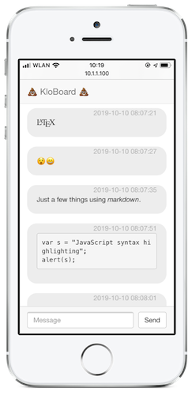

## Usage

Start with

    docker-compose up -d

then go to <http://localhost/stuhlgangscode/foo> for an example.

## "Productive" usage

Print QR codes for each of your toilets navigating to something like <http://example.com/stuhlgangscode/SOME_HASH>. There's no need to register the hash somewhere. Once the first message is posted, it will be added to the database. Currently there's nothing to prevent users from just starting their own chat.
